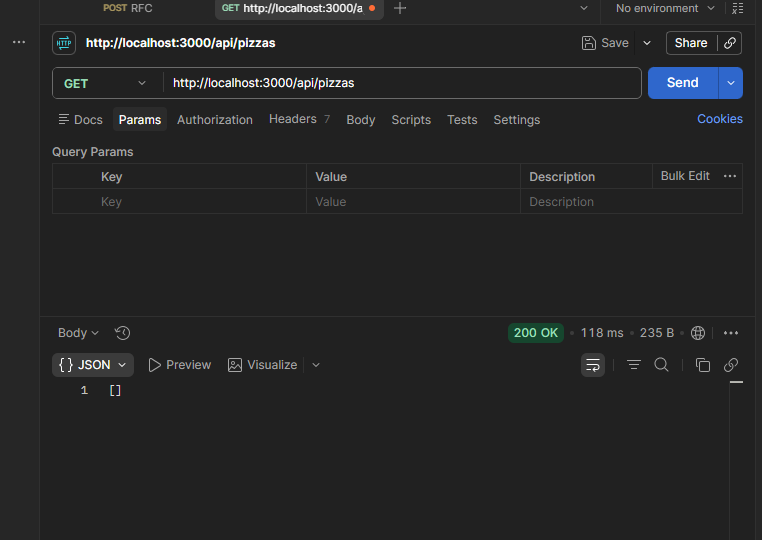

# API REST de Pizzería (Node.js + MongoDB + Docker)

Este proyecto es una API RESTful desarrollada con **Node.js** y **Express** para la gestión de un catálogo de pizzas (CRUD), integrada con una base de datos **MongoDB** que se ejecuta mediante un contenedor de **Docker**. Incluye pruebas automatizadas configuradas y ejecutadas desde **Postman**.

---

##  Descripción del Proyecto

El proyecto implementa una arquitectura modular dividida en capas:
* **`db.js`**: Gestión de la conexión asíncrona mediante el driver oficial de MongoDB.
* **`pizza.repositorio.js`**: Capa de acceso e interacción directa con la base de datos (operaciones CRUD).
* **`pizza.controlador.js`**: Manejo de rutas HTTP y lógica de respuesta del servidor Express.
* **`app.js`**: Punto de entrada de la aplicación que inicia la conexión a la base de datos y despliega el servidor.

---

##  Requisitos Previos

Asegúrate de contar con lo siguiente instalado en tu sistema:
* [Node.js](https://nodejs.org/) (versión v18 o superior)
* [Docker Desktop](https://www.docker.com/products/docker-desktop/) (con WSL 2 activo en Windows)
* [MongoDB Compass](https://www.mongodb.com/products/tools/compass) (opcional, para inspección visual)
* [Postman](https://www.postman.com/) (para ejecución de pruebas HTTP)

---

##  Instrucciones para Ejecutar el Proyecto

### 1. Clonar el repositorio e instalar dependencias

```bash
git clone <URL_DE_TU_REPOSITORIO_EN_GITHUB>
cd mi-proyecto-pizza
npm install
```

### 2. Iniciar la Base de Datos con Docker

Asegúrate de tener **Docker Desktop** abierto en tu equipo. Ejecuta el siguiente comando en tu terminal para descargar e iniciar el contenedor de MongoDB:

```bash
docker run -d -p 27017:27017 --name mongo-pizza mongo:latest
```

* **Puerto local:** `27017`
* **Cadena de conexión Mongo Compass:** `mongodb://localhost:27017`

### 3. Iniciar el Servidor Backend

Ejecuta la aplicación Node.js desde la raíz del proyecto:

```bash
node src/app.js
```

Si la conexión es exitosa, la consola mostrará:
```text
 Connectado exitosamente a MongoDB
 Servidor corriendo en http://localhost:3000
```


##  Pruebas de API con Postman

Las pruebas de los endpoints de la API se realizan apuntando al puerto `3000`.

### Endpoints Disponibles

| Método | Endpoint | Descripción |
| :--- | :--- | :--- |
| **GET** | `/api/pizzas` | Obtiene el listado completo de pizzas |
| **GET** | `/api/pizzas/:id` | Obtiene una pizza específica por ID |
| **POST** | `/api/pizzas` | Crea una nueva pizza |
| **PUT** | `/api/pizzas/:id` | Actualiza una pizza existente |
| **DELETE** | `/api/pizzas/:id` | Elimina una pizza por ID |


### Pasos para probar con la Colección de Postman:
1. Abre **Postman**.
2. Importa el archivo de la colección en formato `.json` (disponible en la carpeta `/testing`).
3. Ejecuta las peticiones o inicia el **Collection Runner** para validar los tests automáticos (respuestas HTTP `200 OK`, `201 Created`).


##  Evidencia de Pruebas (Postman Testing)



